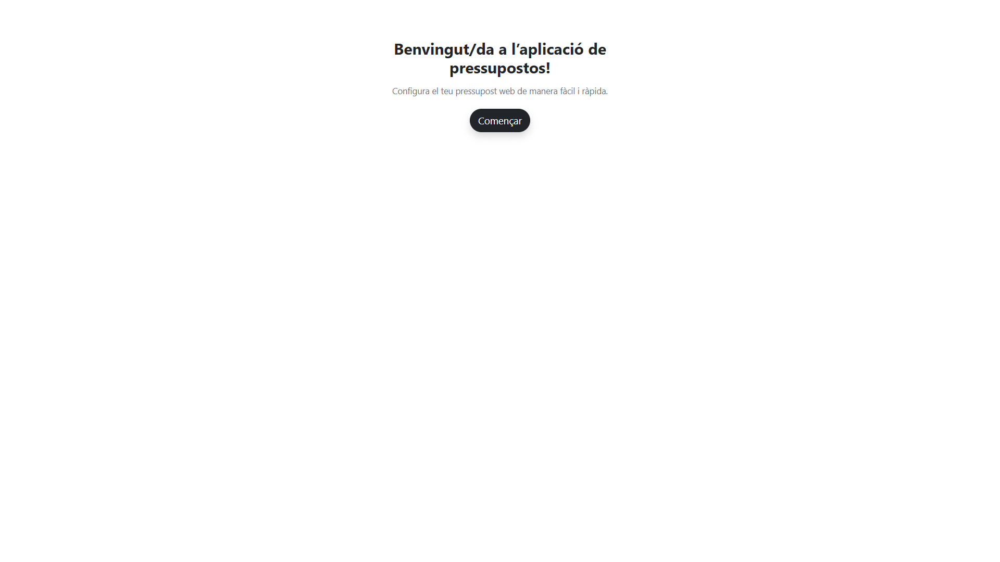
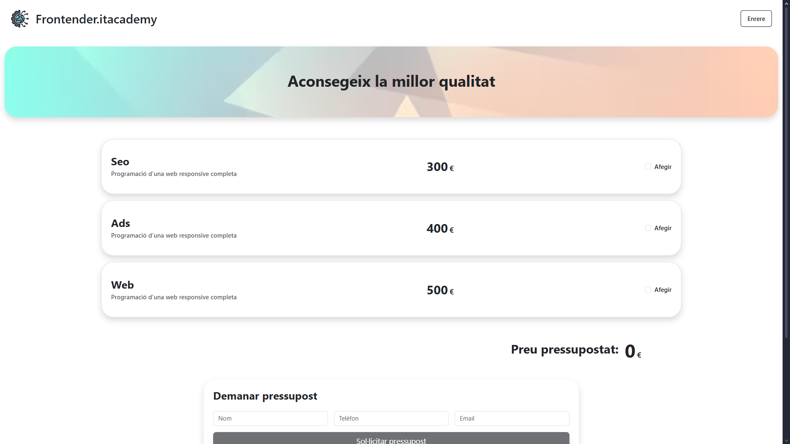
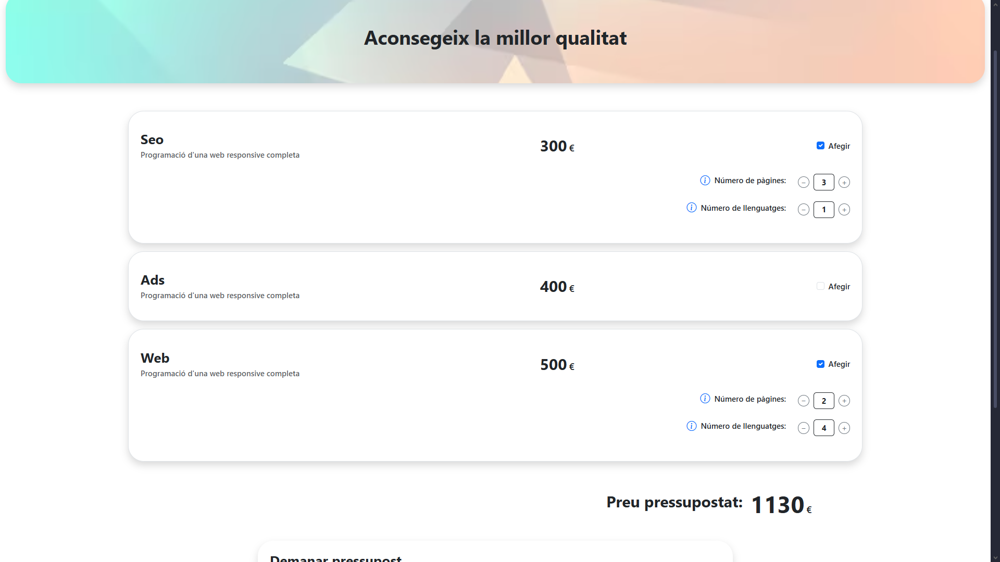
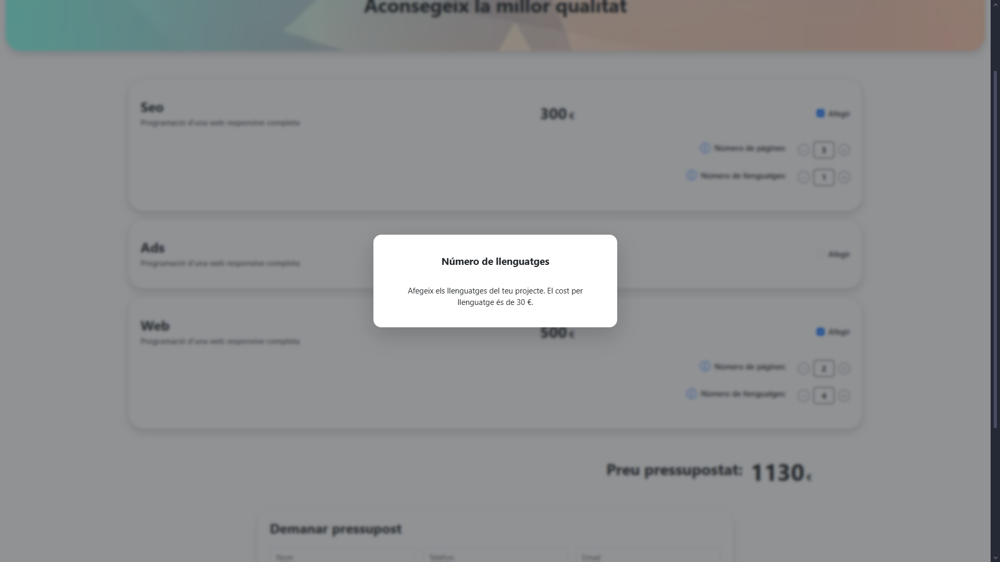
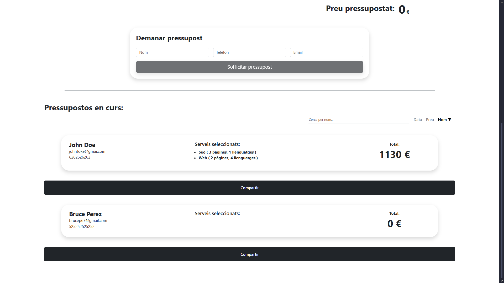
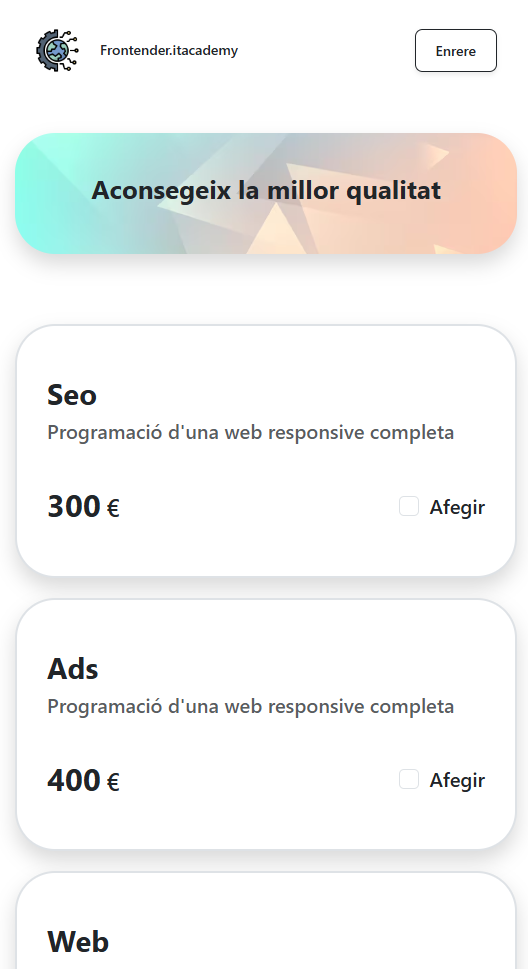
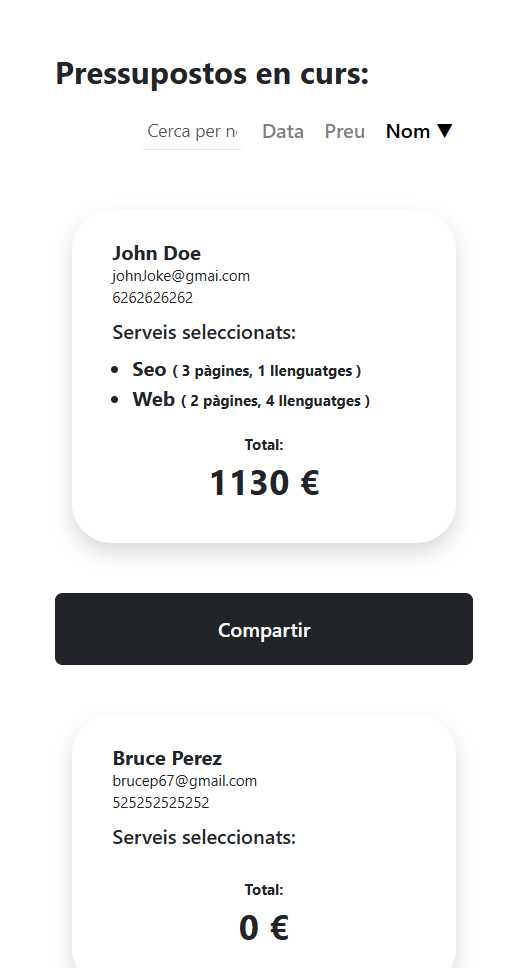

# 6.-Pressupostos-Angular

## 📄 Descripción - Enunciado del ejercicio

Este proyecto es una aplicación desarrollada en **Angular** que permite **crear, gestionar y compartir pressupostos (presupuestos)** de servicios digitales como SEO, ADS y desarrollo web.

El objetivo principal del ejercicio es aplicar los fundamentos intermedios de Angular: **comunicación entre componentes**, **formularios**, **servicios**, **routing con parámetros dinámicos**, **signals**, **filtros**, **ordenación**, y **testing**.

La aplicación permite al usuario configurar un presupuesto, añadir datos personales y guardarlo. Además, los presupuestos generados pueden visualizarse en una lista con opciones de búsqueda, ordenación y compartición mediante URL.

---

## ✨ Funcionalidades

- **Creación de pressupostos dinámicos 🧾**
  El usuario puede activar los servicios deseados (SEO, ADS, Web) e introducir el número de páginas y lenguajes, con un cálculo automático del precio total.

- **Gestión completa de presupuestos 💼**
  Los presupuestos se almacenan en una lista general donde se muestran todos los datos del cliente, servicios seleccionados y el total calculado.

- **Filtrado y búsqueda 🔍**
  Campo de búsqueda para encontrar presupuestos según el nombre del cliente.

- **Ordenación flexible ↕️**
  Tres opciones de ordenación:

  - Por **fecha** (más nuevos o antiguos)
  - Por **precio total**
  - Por **nombre del cliente**

  Además, se muestran **flechas indicadoras (▲ / ▼)** para visualizar el sentido de la ordenación actual.

- **Compartir presupuestos mediante URL 🔗**
  Cada presupuesto puede compartirse con una URL única que incluye sus datos en los parámetros.  
  Al abrir el enlace, el formulario se rellena automáticamente con la información correspondiente.

- **Validaciones del formulario ✅**

  - Nombre obligatorio.
  - Teléfono solo admite números (9–15 dígitos).
  - Email con formato correcto (`@` y dominio).

- **Arquitectura modular basada en componentes 🧩**

  - `Home` → Configura y genera presupuestos.
  - `Panel` → Controla el número de páginas y lenguajes.
  - `BudgetsList` → Lista, busca y ordena presupuestos.
  - `Modal` → Muestra ayudas contextuales.
  - `BudgetService` → Gestiona los datos, cálculos y ordenación usando **Signals**.

- **Testing unitario con Jasmine + Karma 🧪**
  Se incluyen pruebas para los componentes y servicios principales, verificando:
  - Creación de componentes.
  - Cálculo del total.
  - Filtrado y ordenación de presupuestos.
  - Gestión de datos mediante el servicio.

---

## 🏗️ Arquitectura del proyecto

El proyecto sigue una arquitectura modular por componentes, propia de Angular 20:

```bash
src/
├── app/
│ ├── home/
│ │ └── home.component.ts / html / scss / spec.ts
│ ├── budgets-list/
│ │ └── budgets-list.component.ts / html / scss / spec.ts
│ ├── panel/
│ │ └── panel.component.ts / html / scss / spec.ts
│ ├── shared/
│ │ ├── modal/
│ │ │ └── modal.component.ts / html / scss / spec.ts
│ │ └── welcome/
│ │   └── welcome.component.ts / html / scss / spec.ts
│ ├── models/
│ │ └── budget.ts
│ ├── service/
│ │ └── budget.service.ts / spec.ts
│ ├── app.routes.ts
│ ├── app.routes.server.ts
│ ├── app.ts / html / scss
│ ├── app.config.ts
│ └── app.config.server.ts
├── index.html
├── main.server.ts
├── main.ts
└── styles.scss
```

- Se utiliza Angular Signals para gestionar el estado de los presupuestos de forma reactiva.

- Los componentes hijos se comunican con el servicio central BudgetService.

- El enrutado (app.routes.ts) permite navegar entre la pantalla principal y la lista de presupuestos.

- El estilo se maneja con SCSS modular y Bootstrap 5 para una maquetación responsive.

---

## 🎨 Decisiones de diseño

- **Minimalismo visual**
  Se optó por un diseño limpio y ordenado usando Bootstrap, priorizando legibilidad y contraste.

- **Responsive design**
  Adaptado tanto para escritorio como para móviles (máx. 768px), reorganizando las tarjetas de presupuestos en vertical.

- **UX intuitiva**
  El usuario ve los precios y resultados en tiempo real, sin necesidad de recargar la página.

- **Signals en lugar de servicios con BehaviorSubject**
  Se eligió Signals por su integración nativa en Angular 20 y su eficiencia para actualizar vistas sin suscripciones manuales.

---

## ⚠️ Limitaciones conocidas

- Los presupuestos no se almacenan de forma persistente (se pierden al recargar la página).

- El sistema de compartición por URL no cifra los datos, solo los codifica en texto plano.

- La aplicación no gestiona usuarios ni autenticación.

- Los tests cubren solo la lógica principal (no hay pruebas E2E o de interfaz).

- El diseño es básico y podría mejorarse con un sistema de temas o colores personalizados.

---

## 🚀 Roadmap / Mejoras futuras

- **Implementar almacenamiento persistente** (LocalStorage o Firebase).

- Añadir **edición y eliminación** de presupuestos.

- Incorporar **autenticación básica** para usuarios.

- Crear un **modo oscuro / claro**.

- Mejorar la experiencia móvil con animaciones y tarjetas más visuales.

---

## 💻 Tecnologías Utilizadas

- [Angular 20](https://angular.dev)
- **TypeScript**
- **HTML5**
- **SCSS / Bootstrap 5**
- **Angular Forms & Signals**
- **Angular Router**
- **Jasmine + Karma** (para testing)

---

## 📋 Requisitos

Para ejecutar este proyecto se necesita:

- Node.js (v18 o superior)
- Angular CLI instalado globalmente
  ```bash
  npm install -g @angular/cli
  ```
- Un editor de código (recomendado: _Visual Studio Code_)
- Un navegador moderno (_Chrome, Edge, Firefox, OperaGX, etc_)
- **Google Chrome** instalado (requerido por _Karma_ para los tests)

---

## 🛠️ Instalación

1.  Clona el repositorio o descarga los archivos ZIP:

```bash
git clone https://github.com/Alex-Gesti-FrontEnd/6.-Pressupostos-Angular.git
```

2.  Abre la carpeta del proyecto en tu editor de código.

3.  Instala las dependencias:

```bash
npm install
```

---

## Ejecución

### 🖥️ Modo desarrollo

1. Inicia el servidor:

```bash
ng serve
```

2. Abre el navegador y entra en http://localhost:4200.

3. Desde la interfaz principal puedes:

- Activar servicios y ver el precio actualizado.
- Introducir tus datos y guardar un presupuesto.
- Buscar y ordenar presupuestos guardados.
- Compartir el enlace del presupuesto con otros usuarios.

---

### 🧪 Testing

1. Ejecuta los tests con:

```bash
ng test
```

2. Se abrirá una ventana en Chrome mostrando los resultados de las pruebas unitarias (éxitos, fallos y logs detallados). Si no tienes Chrome instalado, configura otro navegador en el archivo _karma.conf.js_.

---

## 🖼️ Demo

A continuación se mostrará algunas capturas de la aplicación en funcionamiento:

- **Pantalla _Welcome_**

<p align="center">
  
</p>

- **Pantalla _Home_**

<p align="center">
  
</p>

- **Opción de presupuesto seleccionado**

<p align="center">
  
</p>

- **Información del precio y del _número de páginas_**

<p align="center">
  
</p>

- **Panel de presupuestos guardados**

<p align="center">
  
</p>

- **Formato móvil**

<p align="center">
  
</p>

<p align="center">
  
</p>

---

## © Derechos de autor

© 2025 [Alex Gesti](https://github.com/alexgesti) — Todos los derechos reservados.
